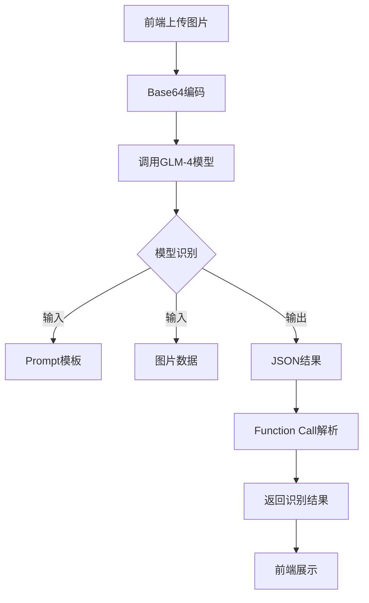

# CMHK 装维质检系统

## 1. 系统概述

# CMHK装维质检系统配置文档


## 2. 用户界面设计

### 2.1 页面布局
整体采用Element Plus的布局组件，包括：
- 顶部导航栏（Header）：固定在顶部，包含logo和主导航菜单（首页、工单详情、速度测试识别、光功率识别、SN码识别、用户信息）
- 主要内容区（Main）：自适应高度，包含各功能模块的具体内容
- 统一的卡片式设计：使用`el-card`组件展示内容

### 2.2 核心页面说明

#### 2.2.1 登录页面
- 布局：居中卡片式设计
- 主要元素：
  - 登录表单：用户名/密码输入框
  - 验证码输入框
  - 登录按钮
  - 忘记密码链接

#### 2.2.2 速度测试识别页面
- 布局：单列布局
- 主要元素：
  - 图片上传区域：支持点击和拖拽上传
  - 预览区域：显示上传的图片
  - 操作按钮：上传/重新上传、开始识别
  - 结果展示区：表格形式展示识别结果

#### 2.2.3 光功率识别页面
- 布局：单列布局
- 主要元素：
  - 图片上传区域：支持点击和拖拽上传
  - 预览区域：显示上传的图片
  - 操作按钮：上传/重新上传、开始识别
  - 结果展示区：包含功率值和测量时间

#### 2.2.4 SN码识别页面
- 布局：单列布局
- 主要元素：
  - 图片上传区域：支持点击和拖拽上传
  - 预览区域：显示上传的图片
  - 操作按钮：上传/重新上传、开始识别
  - 结果展示区：显示SN码和识别时间

  #### 2.2.5 工单

### 2.3 交互设计

#### 2.3.1 图片上传交互
1. 上传触发方式：
   - 点击上传区域
   - 拖拽图片到上传区域
2. 上传限制：
   - 文件类型：仅支持JPG、PNG
   - 文件大小：≤5MB
3. 上传反馈：
   - 上传中：显示加载动画
   - 上传成功：显示预览图
   - 上传失败：显示错误提示

#### 2.3.2 识别过程交互
1. 识别触发：
   - 条件：已上传图片
   - 方式：点击"开始识别"按钮
2. 识别过程：
   - 显示加载动画
   - 禁用操作按钮
3. 识别结果：
   - 成功：显示结构化数据
   - 失败：显示错误提示，支持重试

#### 2.3.3 响应式设计
- 桌面端（≥1200px）：最大宽度800px，居中显示
- 平板端（≥768px）：90%宽度，居中显示
- 移动端（<768px）：全宽显示，适当调整内边距

## 3. 功能模块说明

### 3.1 核心功能模块

#### 3.1.1 速度测试识别
- 功能描述：通过上传网速测试截图，自动识别并提取上传速度、下载速度等信息
- 关键指标：
  - 支持图片格式：JPG、PNG
  - 最大文件大小：5MB
- 识别结果展示：
  - 下载速度（Mbps）
  - 上传速度（Mbps）
  - 参考编号
  - IP地址

#### 3.1.2 光功率识别
- 功能描述：通过上传光功率测试仪截图，自动识别并提取功率值等信息
- 关键指标：
  - 支持图片格式：JPG、PNG
  - 最大文件大小：5MB
- 识别结果展示：
  - 功率值（dBm）
  - 测量时间

#### 3.1.3 SN码识别
- 功能描述：通过上传设备SN码照片，自动识别并提取设备信息
- 关键指标：
  - 支持图片格式：JPG、PNG
  - 最大文件大小：5MB
- 识别结果展示：
  - SN码
  - 识别时间

### 3.2 支撑功能模块

#### 3.2.1 用户管理
- 用户注册：邮箱验证
- 用户登录：账号密码 + 验证码
- 密码重置：邮箱验证
- 用户角色管理
- 登录状态维护

#### 3.2.2 工单管理
- 工单创建
- 工单查询
- 工单状态跟踪
- 工单详情查看
- 工单处理记录

## 4. 技术实现

### 4.1 技术栈
前端技术栈：
- Vue 3：核心框架
- Vite：构建工具
- Element Plus：UI组件库
- Pinia：状态管理
- Vue Router：路由管理
- Axios：HTTP客户端

后端技术栈：
- Spring Boot：应用框架
- Spring Security：安全框架
- JWT：身份认证
- MySQL：关系型数据库
- Redis：缓存
- Maven：依赖管理

### 4.2 系统模块

#### 4.2.1 前端模块
```
frontend/
├── src/
│   ├── assets/          # 静态资源
│   ├── components/      # 公共组件
│   ├── views/          # 页面组件
│   ├── router/         # 路由配置
│   ├── store/          # 状态管理
│   ├── utils/          # 工具函数
│   └── App.vue         # 根组件
```

#### 4.2.2 后端模块
```
backend/
├── src/
│   ├── main/
│   │   ├── java/
│   │   │   ├── controller/    # 控制器
│   │   │   ├── service/       # 业务逻辑
│   │   │   ├── model/         # 数据模型
│   │   │   ├── repository/    # 数据访问
│   │   │   ├── config/        # 配置类
│   │   │   └── security/      # 安全相关
│   │   └── resources/         # 配置文件
│   └── test/                  # 测试代码
```

### 4.3 识别接口实现

#### 4.3.1 技术实现原理
所有识别接口都基于智谱GLM-4大语言模型实现，通过精心设计的prompt模板引导模型输出结构化的JSON数据。

##### 速度测试识别流程


##### 光功率识别流程


##### SN码识别流程


### 4.4 安全设计
- 采用JWT进行身份认证
- 数据库密码加密存储

### 4.5 部署架构
- 配置文件外部化管理

## 5. 开发指南

### 5.1 环境要求
- Node.js >= 16
- JDK >= 1.8
- MySQL >= 5.7
- Redis >= 6.0