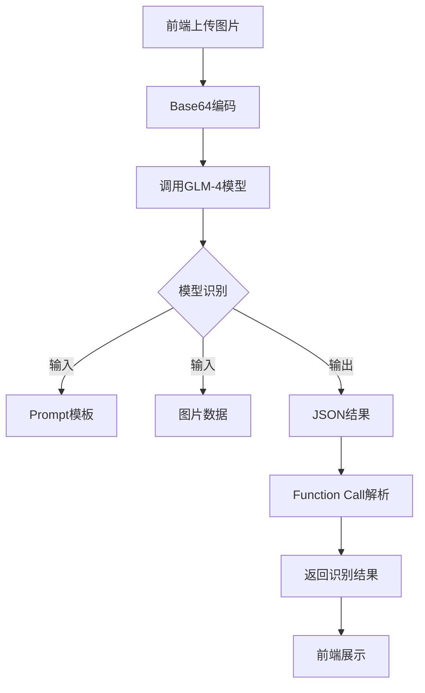

# CMHK 装维质检系统

## 1. 系统概述

# CMHK装维质检系统配置文档

## 1. 配置信息

### 1.1 数据库配置
```yaml
spring:
  datasource:
    url: jdbc:mysql://localhost:3306/cmhk_validation?useUnicode=true&characterEncoding=utf8&serverTimezone=Asia/Shanghai
    username: root
    password: 12345678
    driver-class-name: com.mysql.cj.jdbc.Driver
```

### 1.2 智谱AI配置
```yaml
zhipu:
  api:
    url: https://open.bigmodel.cn/api/paas/v4/chat/completions
    key: 920333e3a5c84ca0b66fd9a634dd0154.QYaybUKaPl5IcM5c
```
# JWT Configuration
JWT_SECRET=your_jwt_secret_key_here
JWT_EXPIRATION=86400000

# Email Configuration
MAIL_HOST=smtp.gmail.com
MAIL_PORT=465
MAIL_USERNAME=ryanzeng666666@gmail.com
MAIL_PASSWORD=mntm hhqe mivr xsdd

### 1.3 服务端口配置
```yaml
# 前端端口
frontend:
  port: 8080

# 后端端口
backend:
  port: 8081
```

## 2. 数据库建表语句

### 2.1 用户相关表
```sql
-- 用户表
CREATE TABLE users (
    id BIGINT AUTO_INCREMENT PRIMARY KEY COMMENT '用户ID',
    username VARCHAR(50) NOT NULL UNIQUE COMMENT '用户名',
    password VARCHAR(100) NOT NULL COMMENT '密码',
    email VARCHAR(100) NOT NULL UNIQUE COMMENT '邮箱',
    role VARCHAR(20) NOT NULL COMMENT '角色：ADMIN/USER',
    status VARCHAR(20) NOT NULL DEFAULT 'ACTIVE' COMMENT '状态',
    created_at TIMESTAMP DEFAULT CURRENT_TIMESTAMP COMMENT '创建时间',
    updated_at TIMESTAMP DEFAULT CURRENT_TIMESTAMP ON UPDATE CURRENT_TIMESTAMP COMMENT '更新时间'
) ENGINE=InnoDB DEFAULT CHARSET=utf8mb4 COMMENT='用户表';

-- 用户验证码表
CREATE TABLE verification_codes (
    id BIGINT AUTO_INCREMENT PRIMARY KEY COMMENT '验证码ID',
    email VARCHAR(100) NOT NULL COMMENT '邮箱',
    code VARCHAR(6) NOT NULL COMMENT '验证码',
    expire_time TIMESTAMP NOT NULL COMMENT '过期时间',
    created_at TIMESTAMP DEFAULT CURRENT_TIMESTAMP COMMENT '创建时间'
) ENGINE=InnoDB DEFAULT CHARSET=utf8mb4 COMMENT='验证码表';
```

### 2.2 工单相关表
```sql
-- 工单表
CREATE TABLE work_orders (
    id BIGINT AUTO_INCREMENT PRIMARY KEY COMMENT '工单ID',
    order_number VARCHAR(50) NOT NULL UNIQUE COMMENT '工单编号',
    customer_name VARCHAR(100) NOT NULL COMMENT '客户名称',
    address VARCHAR(200) NOT NULL COMMENT '安装地址',
    service_type VARCHAR(50) NOT NULL COMMENT '服务类型',
    status VARCHAR(20) NOT NULL COMMENT '状态',
    created_by BIGINT NOT NULL COMMENT '创建人ID',
    assigned_to BIGINT COMMENT '分配给',
    created_at TIMESTAMP DEFAULT CURRENT_TIMESTAMP COMMENT '创建时间',
    updated_at TIMESTAMP DEFAULT CURRENT_TIMESTAMP ON UPDATE CURRENT_TIMESTAMP COMMENT '更新时间',
    FOREIGN KEY (created_by) REFERENCES users(id),
    FOREIGN KEY (assigned_to) REFERENCES users(id)
) ENGINE=InnoDB DEFAULT CHARSET=utf8mb4 COMMENT='工单表';
```

### 2.3 识别记录表
```sql
-- 速度测试记录表
CREATE TABLE speed_test_records (
    id BIGINT AUTO_INCREMENT PRIMARY KEY COMMENT '记录ID',
    work_order_id BIGINT NOT NULL COMMENT '工单ID',
    download_speed DECIMAL(10,2) NOT NULL COMMENT '下载速度(Mbps)',
    upload_speed DECIMAL(10,2) NOT NULL COMMENT '上传速度(Mbps)',
    reference_number VARCHAR(50) NOT NULL COMMENT '参考编号',
    ip_address VARCHAR(50) NOT NULL COMMENT 'IP地址',
    created_at TIMESTAMP DEFAULT CURRENT_TIMESTAMP COMMENT '创建时间',
    FOREIGN KEY (work_order_id) REFERENCES work_orders(id)
) ENGINE=InnoDB DEFAULT CHARSET=utf8mb4 COMMENT='速度测试记录表';

-- 光功率测试记录表
CREATE TABLE optical_power_records (
    id BIGINT AUTO_INCREMENT PRIMARY KEY COMMENT '记录ID',
    work_order_id BIGINT NOT NULL COMMENT '工单ID',
    power_value DECIMAL(10,2) NOT NULL COMMENT '功率值(dBm)',
    measurement_time TIMESTAMP NOT NULL COMMENT '测量时间',
    device_model VARCHAR(100) NOT NULL COMMENT '设备型号',
    status VARCHAR(20) NOT NULL COMMENT '状态',
    created_at TIMESTAMP DEFAULT CURRENT_TIMESTAMP COMMENT '创建时间',
    FOREIGN KEY (work_order_id) REFERENCES work_orders(id)
) ENGINE=InnoDB DEFAULT CHARSET=utf8mb4 COMMENT='光功率测试记录表';

-- SN码记录表
CREATE TABLE sn_code_records (
    id BIGINT AUTO_INCREMENT PRIMARY KEY COMMENT '记录ID',
    work_order_id BIGINT NOT NULL COMMENT '工单ID',
    sn_code VARCHAR(100) NOT NULL COMMENT 'SN码',
    device_model VARCHAR(100) NOT NULL COMMENT '设备型号',
    production_date DATE NOT NULL COMMENT '生产日期',
    batch_number VARCHAR(50) NOT NULL COMMENT '批次号',
    created_at TIMESTAMP DEFAULT CURRENT_TIMESTAMP COMMENT '创建时间',
    FOREIGN KEY (work_order_id) REFERENCES work_orders(id)
) ENGINE=InnoDB DEFAULT CHARSET=utf8mb4 COMMENT='SN码记录表';
```

## 3. 图像识别Prompt配置

### 3.1 速度测试识别
```
请识别该网速测试截图中的上传速度、下载速度、参考编号和IP地址。
请以JSON格式返回，包含以下字段：
{
    "downloadSpeed": "下载速度，单位Mbps",
    "uploadSpeed": "上传速度，单位Mbps",
    "referenceNumber": "参考编号",
    "ipAddress": "IP地址"
}
```

### 3.2 光功率识别
```
请识别该光功率测试仪截图中的功率值、测量时间、设备型号等信息。
请以JSON格式返回，包含以下字段：
{
    "powerValue": "功率值，单位dBm",
    "measureTime": "测量时间",
    "deviceModel": "设备型号",
    "status": "状态，normal或abnormal"
}
```

### 3.3 SN码识别
```
请识别该设备SN码照片中的序列号、设备型号、生产日期等信息。
请以JSON格式返回，包含以下字段：
{
    "snCode": "SN码",
    "deviceModel": "设备型号",
    "productionDate": "生产日期",
    "batchNumber": "批次号"
}
```

## 4. 初始化数据

### 4.1 创建管理员账户
```sql
-- 默认管理员账户 (密码: admin123)
INSERT INTO users (username, password, email, role) 
VALUES ('admin', '$2a$10$rDmFN6ZqJ/Y9E9BkDZ3j6.IqSj7sHX7EW3Qi2IYT9FyKVoHDaBj.2', 'admin@example.com', 'ADMIN');
```

## 5. 注意事项

1. 数据库配置
   - 生产环境请修改默认密码
   - 建议开启数据库日志
   - 定期备份数据

2. API密钥安全
   - 不要将API密钥提交到代码仓库
   - 建议使用环境变量方式注入
   - 定期更换API密钥

3. 端口配置
   - 确保端口未被占用
   - 生产环境建议使用反向代理
   - 配置适当的防火墙规则 

### 1.1 产品简介
CMHK装维质检系统是一个面向通信设备维护人员的智能识别平台，旨在提高工作效率和准确性。该系统能够通过AI技术自动识别速度测试截图、光功率读数和设备SN码，实现快速数据采集和质量检查。

### 1.2 系统架构
- 采用前后端分离架构
- 前端端口：8080
- 后端端口：8081
- RESTful API接口规范
- 统一的认证和授权中心

## 2. 用户界面设计

### 2.1 页面布局
整体采用Element Plus的布局组件，包括：
- 顶部导航栏（Header）：固定在顶部，包含logo和主导航菜单（首页、工单详情、速度测试识别、光功率识别、SN码识别、用户信息）
- 主要内容区（Main）：自适应高度，包含各功能模块的具体内容
- 统一的卡片式设计：使用`el-card`组件展示内容

### 2.2 核心页面说明

#### 2.2.1 登录页面
- 布局：居中卡片式设计
- 主要元素：
  - 登录表单：用户名/密码输入框
  - 验证码输入框
  - 登录按钮
  - 忘记密码链接

#### 2.2.2 速度测试识别页面
- 布局：单列布局
- 主要元素：
  - 图片上传区域：支持点击和拖拽上传
  - 预览区域：显示上传的图片
  - 操作按钮：上传/重新上传、开始识别
  - 结果展示区：表格形式展示识别结果

#### 2.2.3 光功率识别页面
- 布局：单列布局
- 主要元素：
  - 图片上传区域：支持点击和拖拽上传
  - 预览区域：显示上传的图片
  - 操作按钮：上传/重新上传、开始识别
  - 结果展示区：包含功率值和测量时间

#### 2.2.4 SN码识别页面
- 布局：单列布局
- 主要元素：
  - 图片上传区域：支持点击和拖拽上传
  - 预览区域：显示上传的图片
  - 操作按钮：上传/重新上传、开始识别
  - 结果展示区：显示SN码和识别时间

### 2.3 交互设计

#### 2.3.1 图片上传交互
1. 上传触发方式：
   - 点击上传区域
   - 拖拽图片到上传区域
2. 上传限制：
   - 文件类型：仅支持JPG、PNG
   - 文件大小：≤5MB
3. 上传反馈：
   - 上传中：显示加载动画
   - 上传成功：显示预览图
   - 上传失败：显示错误提示

#### 2.3.2 识别过程交互
1. 识别触发：
   - 条件：已上传图片
   - 方式：点击"开始识别"按钮
2. 识别过程：
   - 显示加载动画
   - 禁用操作按钮
3. 识别结果：
   - 成功：显示结构化数据
   - 失败：显示错误提示，支持重试

#### 2.3.3 响应式设计
- 桌面端（≥1200px）：最大宽度800px，居中显示
- 平板端（≥768px）：90%宽度，居中显示
- 移动端（<768px）：全宽显示，适当调整内边距

## 3. 功能模块说明

### 3.1 核心功能模块

#### 3.1.1 速度测试识别
- 功能描述：通过上传网速测试截图，自动识别并提取上传速度、下载速度等信息
- 关键指标：
  - 支持图片格式：JPG、PNG
  - 最大文件大小：5MB
- 识别结果展示：
  - 下载速度（Mbps）
  - 上传速度（Mbps）
  - 参考编号
  - IP地址

#### 3.1.2 光功率识别
- 功能描述：通过上传光功率测试仪截图，自动识别并提取功率值等信息
- 关键指标：
  - 支持图片格式：JPG、PNG
  - 最大文件大小：5MB
- 识别结果展示：
  - 功率值（dBm）
  - 测量时间

#### 3.1.3 SN码识别
- 功能描述：通过上传设备SN码照片，自动识别并提取设备信息
- 关键指标：
  - 支持图片格式：JPG、PNG
  - 最大文件大小：5MB
- 识别结果展示：
  - SN码
  - 识别时间

### 3.2 支撑功能模块

#### 3.2.1 用户管理
- 用户注册：邮箱验证
- 用户登录：账号密码 + 验证码
- 密码重置：邮箱验证
- 用户角色管理
- 登录状态维护

#### 3.2.2 工单管理
- 工单创建
- 工单查询
- 工单状态跟踪
- 工单详情查看
- 工单处理记录

## 4. 技术实现

### 4.1 技术栈
前端技术栈：
- Vue 3：核心框架
- Vite：构建工具
- Element Plus：UI组件库
- Pinia：状态管理
- Vue Router：路由管理
- Axios：HTTP客户端

后端技术栈：
- Spring Boot：应用框架
- Spring Security：安全框架
- JWT：身份认证
- MySQL：关系型数据库
- Redis：缓存
- Maven：依赖管理

### 4.2 系统模块

#### 4.2.1 前端模块
```
frontend/
├── src/
│   ├── assets/          # 静态资源
│   ├── components/      # 公共组件
│   ├── views/          # 页面组件
│   ├── router/         # 路由配置
│   ├── store/          # 状态管理
│   ├── utils/          # 工具函数
│   └── App.vue         # 根组件
```

#### 4.2.2 后端模块
```
backend/
├── src/
│   ├── main/
│   │   ├── java/
│   │   │   ├── controller/    # 控制器
│   │   │   ├── service/       # 业务逻辑
│   │   │   ├── model/         # 数据模型
│   │   │   ├── repository/    # 数据访问
│   │   │   ├── config/        # 配置类
│   │   │   └── security/      # 安全相关
│   │   └── resources/         # 配置文件
│   └── test/                  # 测试代码
```

### 4.3 识别接口实现

#### 4.3.1 技术实现原理
所有识别接口都基于智谱GLM-4大语言模型实现，通过精心设计的prompt模板引导模型输出结构化的JSON数据。

##### 速度测试识别流程


##### 光功率识别流程


##### SN码识别流程


### 4.4 安全设计
- 采用JWT进行身份认证
- 数据库密码加密存储

### 4.5 部署架构
- 配置文件外部化管理

## 5. 开发指南

### 5.1 环境要求
- Node.js >= 16
- JDK >= 1.8
- MySQL >= 5.7
- Redis >= 6.0